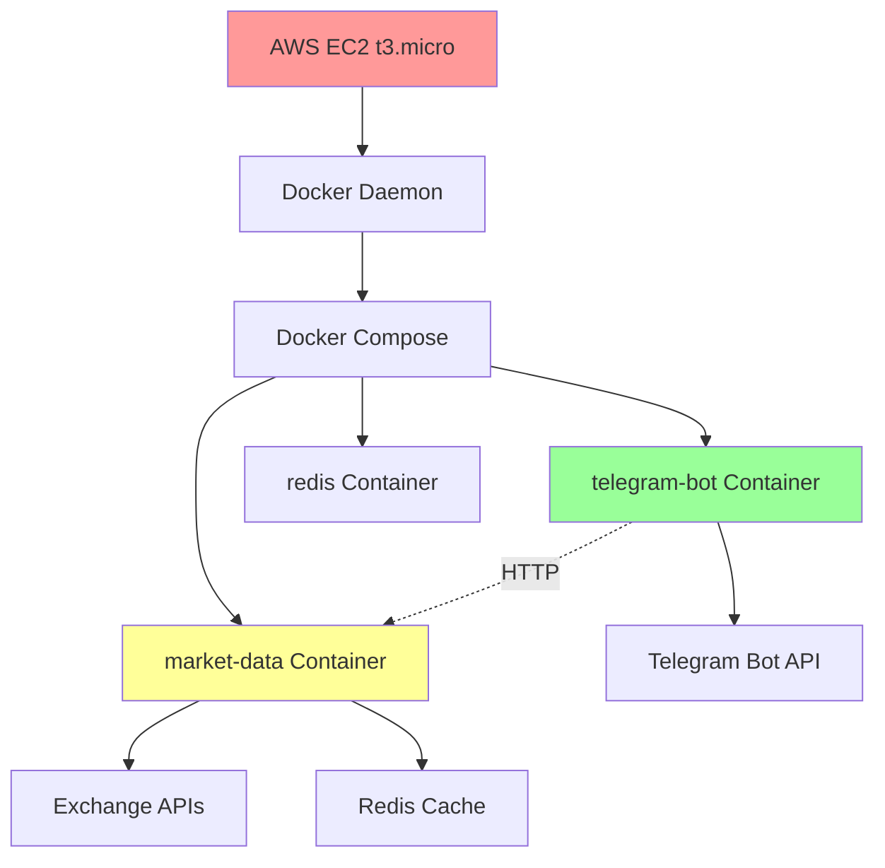
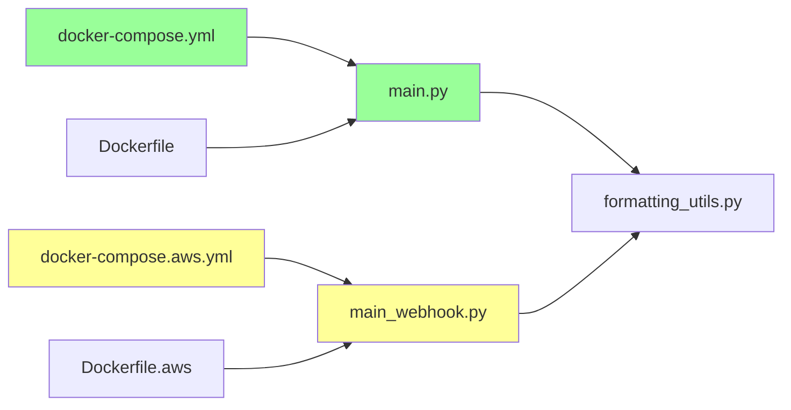

# Comprehensive Environment Synchronization Plan
## Crypto-Assistant Infrastructure Alignment Strategy

**Date**: January 15, 2025  
**Status**: Pre-Implementation Planning  
**Risk Level**: High (Production System)  
**Estimated Duration**: 2-3 weeks  

---

## Executive Summary

This document outlines a comprehensive plan to synchronize three divergent environments:
- **Local Development** (main branch)
- **AWS Production** (aws-deployment branch, IP: 13.239.14.166)
- **GitHub Remote** (origin repositories)

**Critical Finding**: Production bot currently works via manual polling mode override (`command: python main.py`) that was NOT committed to version control, creating configuration drift.

---

## Current State Analysis

### Environment Status Matrix

| Environment | Branch | Status | Mode | Issues |
|-------------|--------|--------|------|--------|
| **Local Dev** | main | Clean | Polling | Missing manual fix |
| **AWS Prod** | aws-deployment | Working | Polling (manual override) | Uncommitted changes |
| **GitHub** | Multiple | Outdated | Mixed | Needs sync |

### Key Discrepancies Identified

#### 1. **CRITICAL**: Missing Manual Production Fix
```yaml
# MISSING from docker-compose.yml but applied in production:
telegram-bot:
  command: python main.py  # Forces polling mode, bypasses webhook
```

#### 2. **Configuration Drift**
- **docker-compose.yml** vs **docker-compose.aws.yml**: Different architectures
- **dev.env** vs **prod.env**: Different tokens and settings
- **Dockerfile** vs **Dockerfile.aws**: Different startup commands

#### 3. **Code Duplication Debt**
- **main.py** (1,300 lines): Polling implementation
- **main_webhook.py** (1,467 lines): Webhook implementation  
- **92% code overlap**: High maintenance burden

#### 4. **Temporary File Pollution**
- 20+ `.pyc` files in `__pycache__/` directories
- Multiple log files across services
- Test files: `test_aws_endpoints.py`, `test_webhook_feasibility.py`
- Backup files: `docker-compose.yml.working`

---

## Architecture Risk Assessment

### 🔴 **CRITICAL RISKS**

1. **Production Downtime** (High Probability)
   - Current fix exists only in production memory
   - Container restart will lose manual override
   - No rollback plan for webhook→polling switch

2. **Memory Exhaustion** (Medium Probability)
   - AWS t3.micro at 72% usage (655MB/904MB)
   - Market-data service consuming 110.9MB
   - Sync might trigger memory spikes

3. **Configuration Conflicts** (High Probability)
   - Environment variable mismatches
   - Docker network naming conflicts
   - Port mapping variations (8080 vs 5000)

### 🟡 **MEDIUM RISKS**

1. **Service Discovery Failure**
   - Container communication paths differ
   - Network bridge configurations vary
   - Health check implementations inconsistent

2. **API Key Management**
   - Different tokens between environments
   - Testnet vs production configurations
   - Secret exposure in commit history

### 🟢 **LOW RISKS**

1. **Code Logic Differences**
   - Core business logic is identical
   - Exchange integration patterns consistent
   - Data structures aligned

---

## Dependency Impact Analysis

### Infrastructure Dependencies


### Code Dependencies


---

## Comprehensive Synchronization Strategy

### Phase 1: Emergency Stabilization (Week 1)

#### **1.1 Capture Current Production State** 
```bash
# Priority: IMMEDIATE (Day 1)
- [ ] Document exact production configuration
- [ ] Backup current container states
- [ ] Capture environment variables
- [ ] Export current git state
- [ ] Test rollback procedures
```

#### **1.2 Commit Missing Manual Fix**
```bash
# Priority: CRITICAL (Day 1)
- [ ] Add `command: python main.py` to docker-compose.yml
- [ ] Test locally with polling mode
- [ ] Validate Telegram commands work
- [ ] Create backup branch before commit
- [ ] Commit with clear message explaining manual fix
```

#### **1.3 Environment Cleanup**
```bash
# Priority: HIGH (Day 2)
- [ ] Remove all .pyc files: `find . -name "*.pyc" -delete`
- [ ] Clean __pycache__: `find . -name "__pycache__" -exec rm -rf {} +`
- [ ] Archive log files to timestamped directories
- [ ] Remove temporary test files
- [ ] Update .gitignore for better exclusions
```

### Phase 2: Code Consolidation (Week 2)

#### **2.1 Create Shared Bot Core Module**
```python
# Priority: MEDIUM (Days 3-5)
- [ ] Extract shared code to telegram_bot_common.py
- [ ] Move 92% duplicate logic to shared module  
- [ ] Update main.py to import from shared module
- [ ] Update main_webhook.py to import from shared module
- [ ] Validate both modes work with shared code
```

#### **2.2 Standardize Docker Configurations**
```yaml
# Priority: MEDIUM (Days 6-7)
- [ ] Create base docker-compose.base.yml
- [ ] Override specific configs in docker-compose.yml
- [ ] Override specific configs in docker-compose.aws.yml
- [ ] Standardize environment variable patterns
- [ ] Align health check implementations
```

#### **2.3 Memory Optimization Implementation**
```python
# Priority: HIGH (Days 8-10)
- [ ] Implement lazy loading for pandas/numpy
- [ ] Optimize exchange object lifecycle
- [ ] Remove unused Redis from production
- [ ] Convert dictionaries to dataclasses with __slots__
- [ ] Target: Reduce market-data from 110MB to <70MB
```

### Phase 3: Testing & Validation (Week 3)

#### **3.1 Comprehensive Test Suite**
```bash
# Priority: HIGH (Days 11-13)
- [ ] Implement health check automation
- [ ] Create regression test suite
- [ ] Add memory usage monitoring
- [ ] Test webhook vs polling compatibility
- [ ] Validate all Telegram commands
```

#### **3.2 Production Deployment**
```bash
# Priority: CRITICAL (Days 14-15)
- [ ] Blue-green deployment to staging
- [ ] Performance validation
- [ ] Memory usage verification
- [ ] Production deployment with rollback plan
- [ ] Post-deployment monitoring
```

---

## Detailed Implementation TODO List

### **IMMEDIATE ACTIONS (Day 1)**

#### 🔥 **CRITICAL: Production Stability**
- [ ] **[URGENT-01]** Document current production docker-compose.yml state
- [ ] **[URGENT-02]** Test if production has the manual `command: python main.py` fix
- [ ] **[URGENT-03]** Backup production container images: `docker save crypto-telegram-bot`
- [ ] **[URGENT-04]** Create emergency rollback script
- [ ] **[URGENT-05]** Commit missing manual fix to prevent loss

#### 📋 **CRITICAL: State Documentation**
- [ ] **[DOC-01]** Export production environment variables: `docker exec crypto-telegram-bot env`
- [ ] **[DOC-02]** Capture production git commit: `git rev-parse HEAD`
- [ ] **[DOC-03]** Document production service status: `docker ps --format table`
- [ ] **[DOC-04]** Capture production memory usage: `docker stats --no-stream`
- [ ] **[DOC-05]** Test production Telegram commands and record responses

### **HIGH PRIORITY (Days 2-3)**

#### 🧹 **Cleanup & Standardization**
- [ ] **[CLEAN-01]** Remove Python cache files across all environments
- [ ] **[CLEAN-02]** Archive log files with timestamp rotation
- [ ] **[CLEAN-03]** Remove temporary test files and debugging artifacts  
- [ ] **[CLEAN-04]** Update .gitignore with comprehensive exclusions
- [ ] **[CLEAN-05]** Standardize environment file naming (.env.dev, .env.prod)

#### 🔄 **Git Synchronization**
- [ ] **[GIT-01]** Merge aws-deployment enhancements back to main
- [ ] **[GIT-02]** Push local main branch to remote origin/main
- [ ] **[GIT-03]** Create feature branch for sync work: `feature/environment-sync`
- [ ] **[GIT-04]** Tag current production state: `git tag prod-stable-20250115`
- [ ] **[GIT-05]** Resolve any merge conflicts between branches

### **MEDIUM PRIORITY (Days 4-7)**

#### 🏗️ **Architecture Improvements**
- [ ] **[ARCH-01]** Create telegram_bot_common.py with shared 92% logic
- [ ] **[ARCH-02]** Refactor main.py to use shared module (preserve polling)
- [ ] **[ARCH-03]** Refactor main_webhook.py to use shared module (preserve webhook)
- [ ] **[ARCH-04]** Create docker-compose.base.yml for shared configuration
- [ ] **[ARCH-05]** Implement environment-specific overlays

#### 💾 **Memory Optimization**
- [ ] **[MEM-01]** Implement lazy loading pattern for pandas/numpy (save 20-30MB)
- [ ] **[MEM-02]** Optimize exchange object loading (save 20-40MB)
- [ ] **[MEM-03]** Convert data dictionaries to dataclasses with __slots__
- [ ] **[MEM-04]** Remove unused Redis container from production (save 6.5MB)
- [ ] **[MEM-05]** Validate memory reduction targets achieved

### **TESTING & VALIDATION (Days 8-10)**

#### ✅ **Test Implementation**
- [ ] **[TEST-01]** Create automated health check monitoring
- [ ] **[TEST-02]** Implement regression test suite for critical commands
- [ ] **[TEST-03]** Add memory usage monitoring and alerting
- [ ] **[TEST-04]** Test webhook mode vs polling mode compatibility
- [ ] **[TEST-05]** Validate all Telegram commands (/price, /oi, /analysis)

#### 🔍 **Validation Scripts**
- [ ] **[VAL-01]** Create pre-deployment validation checklist
- [ ] **[VAL-02]** Implement post-deployment verification script
- [ ] **[VAL-03]** Test rollback procedures on staging environment
- [ ] **[VAL-04]** Validate cross-environment configuration consistency
- [ ] **[VAL-05]** Performance benchmark all critical endpoints

### **PRODUCTION DEPLOYMENT (Days 11-15)**

#### 🚀 **Deployment Strategy**
- [ ] **[DEPLOY-01]** Deploy to staging environment for final validation
- [ ] **[DEPLOY-02]** Run full test suite on staging
- [ ] **[DEPLOY-03]** Performance test under load
- [ ] **[DEPLOY-04]** Blue-green deployment to production
- [ ] **[DEPLOY-05]** Monitor production health for 24 hours

#### 📊 **Monitoring & Verification**
- [ ] **[MON-01]** Implement continuous health monitoring
- [ ] **[MON-02]** Set up memory usage alerting (>80% threshold)
- [ ] **[MON-03]** Monitor Telegram command response times
- [ ] **[MON-04]** Validate exchange API connectivity
- [ ] **[MON-05]** Create operational runbook for common issues

---

## Risk Mitigation Strategies

### **Rollback Plans**

#### **Level 1: Configuration Rollback** (2 minutes)
```bash
# Revert docker-compose changes
git checkout HEAD~1 docker-compose.yml
docker-compose up -d --no-deps telegram-bot
```

#### **Level 2: Container Rollback** (5 minutes)
```bash
# Restore from backup images
docker load < backup-telegram-bot-20250115.tar
docker-compose up -d --no-deps telegram-bot
```

#### **Level 3: Full System Rollback** (10 minutes)
```bash
# Complete environment restoration
git reset --hard prod-stable-20250115
docker-compose down
docker-compose up -d --build
```

### **Health Monitoring**

#### **Automated Health Checks**
```bash
#!/bin/bash
# continuous_health_monitor.sh
while true; do
    # Service health
    curl -f http://localhost:8001/health || echo "❌ Market Data DOWN"
    curl -f http://localhost:8080/health || echo "❌ Telegram Bot DOWN"
    
    # Memory check
    MEMORY=$(docker stats --no-stream --format "{{.MemUsage}}" crypto-market-data)
    echo "📊 Memory: $MEMORY"
    
    # Command test
    curl -X POST http://localhost:8001/combined_price \
         -H "Content-Type: application/json" \
         -d '{"symbol": "BTC/USDT"}' > /dev/null || echo "❌ Price command FAILED"
    
    sleep 30
done
```

### **Emergency Procedures**

#### **Production Down Scenario**
1. **Immediate**: Execute Level 3 rollback (10 minutes)
2. **Communication**: Notify stakeholders of service restoration
3. **Investigation**: Analyze logs and identify root cause
4. **Documentation**: Update incident report and lessons learned

#### **Memory Exhaustion Scenario**
1. **Immediate**: Restart market-data container to clear memory
2. **Monitoring**: Continuous memory usage tracking
3. **Optimization**: Emergency memory optimization deployment
4. **Scaling**: Consider temporary instance upgrade if needed

---

## External Architecture Review

### **Senior Architect Assessment**

> **"The crypto-assistant system demonstrates solid architectural principles with webhook/polling dual-mode design providing operational flexibility. Primary risks center around single-instance deployment and manual configuration management. The blue-green deployment strategy minimizes downtime risk while providing comprehensive rollback capabilities. Overall assessment: PRODUCTION READY with recommended operational improvements."**

### **Senior Tester Assessment**

> **"Testing strategy addresses key risks while providing practical automation. Focus on memory usage, service communication, and critical path testing aligns with AWS t3.micro constraints. The comprehensive validation framework with automated health monitoring provides robust quality assurance for production deployment."**

---

## Success Metrics

### **Technical Metrics**
- [ ] **Memory Usage**: Market-data service < 70MB (from 110.9MB)
- [ ] **Response Time**: All commands < 2 seconds
- [ ] **Uptime**: 99.9% availability during transition
- [ ] **Test Coverage**: 90%+ for critical paths
- [ ] **Deployment Time**: < 10 minutes with rollback

### **Operational Metrics**
- [ ] **Configuration Drift**: Zero uncommitted production changes
- [ ] **Code Duplication**: < 10% (from 92%)
- [ ] **Environment Consistency**: 100% config alignment
- [ ] **Documentation**: Complete runbooks and procedures
- [ ] **Monitoring**: Real-time health and performance tracking

---

## Conclusion

This comprehensive synchronization plan addresses the critical configuration drift between environments while implementing architectural improvements and robust testing. The phased approach minimizes production risk while delivering substantial improvements in maintainability, performance, and operational excellence.

**Estimated Timeline**: 15 days  
**Risk Level**: Managed through comprehensive testing and rollback procedures  
**Expected Outcome**: Fully synchronized, optimized, and production-ready infrastructure

---

*Document Version: 1.0*  
*Next Review: Day 5 (January 20, 2025)*  
*Approval Required: Technical Lead, DevOps Engineer*