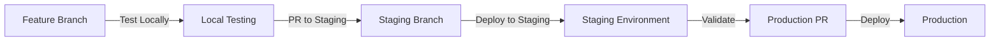

# 🚨 PRODUCTION RECOVERY PLAN & DEVELOPMENT WORKFLOW

## Critical Situation Analysis

### What Went Wrong
1. **Lost Track of Production State**: Production was stable on July 4th deployment
2. **Uncontrolled Local Development**: Made extensive changes without proper tracking
3. **No Impact Analysis**: Failed to assess changes before attempting deployment
4. **Git Sync Issues**: Local and production branches diverged significantly
5. **Deployment Attempted Without Testing**: Tried to push untested features to production

### Current State (July 14, 2025)
- **Production**: Running July 4th code (stable but missing features)
- **Local**: Has July 12-13 enhancements (untested in production environment)
- **Container Status**: Bot showing "unhealthy" but may still be functional
- **Risk Level**: HIGH - Production could break with wrong deployment

## IMMEDIATE RECOVERY STEPS

### Step 1: Document Current Production State
```bash
# On AWS (DO NOT MODIFY ANYTHING YET)
ssh -i ~/.ssh/crypto-bot-key.pem ec2-user@13.239.14.166

# Capture current state
cd /home/ec2-user/TG-Bot
git log --oneline -10 > ~/production_state.txt
git status >> ~/production_state.txt
git diff >> ~/production_state.txt
docker ps --no-trunc >> ~/production_state.txt
docker-compose -f docker-compose.aws.yml config >> ~/production_state.txt

# Test current functionality
curl -X POST http://localhost:8001/health
curl http://localhost:8080/health
# Send test command to Telegram bot
```

### Step 2: Create Production Backup
```bash
# Tag current production state
git tag production-stable-july14 HEAD
git push origin production-stable-july14

# Backup Docker volumes
docker run --rm -v tg-bot_redis-data:/data -v $(pwd)/backup:/backup alpine tar czf /backup/redis-backup.tar.gz -C /data .

# Document environment
env | grep -E "(API|TOKEN|EXCHANGE)" > ~/production_env_backup.txt
```

### Step 3: Local Environment Analysis
```bash
# In local environment
cd /Users/screener-m3/projects/crypto-assistant

# Create feature branch for unverified changes
git checkout -b feature/july12-enhancements
git add -A
git commit -m "WIP: Unverified July 12-13 enhancements"

# Switch back to stable aws-deployment
git checkout aws-deployment
git reset --hard production-stable-july14  # Reset to production state
```

## PROPER DEVELOPMENT WORKFLOW

### 1. Three-Environment Strategy
```
LOCAL (Development) → STAGING (Testing) → PRODUCTION (Stable)
```

### 2. Branch Strategy
```
main (stable production code)
├── aws-deployment (current production)
├── staging (pre-production testing)
└── feature/* (development branches)
```

### 3. Development Process


## VALIDATION FRAMEWORK

### Pre-Deployment Checklist
- [ ] All tests passing locally
- [ ] Git diff reviewed line-by-line
- [ ] Environment variables documented
- [ ] Container health checks verified
- [ ] API endpoints tested
- [ ] Rollback plan prepared
- [ ] Staging deployment successful
- [ ] 24-hour staging soak test
- [ ] Performance benchmarks met
- [ ] Security scan completed

### Testing Protocol
```bash
# 1. Local Testing Suite
python3 -m pytest tests/ -v
python3 validate_calculations.py
python3 test_aws_production.py

# 2. Integration Testing
./validate_deployed_system.sh
curl -X POST http://localhost:8001/comprehensive_analysis -d '{"symbol": "BTC/USDT"}'

# 3. Telegram Bot Testing
python3 simulate_bot_responses.py
```

## SAFE FEATURE DEPLOYMENT

### Step 1: Create Staging Environment
```bash
# Create minimal staging on local machine
docker-compose -f docker-compose.staging.yml up -d
# Test all features locally first
```

### Step 2: Incremental Deployment
```bash
# Deploy features one at a time
1. Deploy infrastructure changes (environment variables)
2. Deploy market-data service updates
3. Deploy telegram-bot formatting changes
4. Deploy new command features
```

### Step 3: Validation After Each Step
```bash
# After each deployment
- Check container health
- Test specific feature
- Monitor logs for 10 minutes
- Run integration tests
- Rollback if any issues
```

## ROLLBACK PROCEDURES

### Immediate Rollback
```bash
# On AWS
cd /home/ec2-user/TG-Bot
git reset --hard production-stable-july14
docker-compose -f docker-compose.aws.yml down
docker-compose -f docker-compose.aws.yml up -d --build
```

### Container-Level Rollback
```bash
# Rollback specific container
docker-compose -f docker-compose.aws.yml up -d --no-deps telegram-bot
```

## GOING FORWARD: DEVELOPMENT RULES

### 1. NEVER Deploy Untested Code
- All features must pass local tests
- Must be tested in staging for 24 hours
- Must have rollback plan

### 2. ALWAYS Do Impact Analysis
```bash
# Before any changes
git diff --stat main..feature-branch
git diff main..feature-branch -- services/
# Review every changed file
```

### 3. Maintain Development Log
```markdown
## Development Log
Date: July 14, 2025
Changes: Enhanced /price command
Files Modified: formatting_utils.py, main_webhook.py
Testing Status: Local only
Production Impact: High - changes core bot functionality
Rollback Plan: git reset --hard production-stable-july14
```

### 4. Use Feature Flags
```python
# In code
FEATURES = {
    'enhanced_price_display': os.getenv('ENABLE_ENHANCED_PRICE', 'false') == 'true',
    'scalable_exchanges': os.getenv('ENABLE_SCALABLE_EXCHANGES', 'false') == 'true'
}

# Deploy with features disabled, enable gradually
```

## IMMEDIATE NEXT STEPS

1. **Stabilize Production**: Ensure current production is working
2. **Create Clean Branch**: Reset aws-deployment to production state  
3. **Cherry-Pick Features**: Add features one by one with testing
4. **Establish Staging**: Set up proper staging environment
5. **Document Everything**: Every change, test, and deployment

## Lessons Learned
1. Production stability > New features
2. Always maintain rollback capability
3. Test in isolation before integration
4. Document state before changes
5. Use incremental deployment
6. Monitor after each change
7. Have clear success criteria

---
*This plan prioritizes production stability while establishing proper development practices to prevent future issues.*